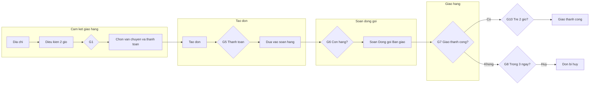
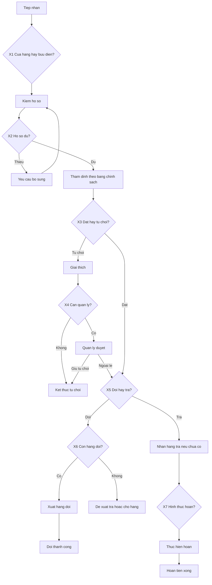

# Hướng dẫn vẽ sơ đồ BPMN — Quy trình B2 và B4

**Mục đích:** hướng dẫn nhóm vẽ hai sơ đồ BPMN 2.0 cho quy trình cốt lõi (*core processes*).  
**Nguyên tắc:** cổng XOR (*XOR gateway*) chỉ đặt khi **luồng phía sau khác nhau**; tiêu chí kiểm tra trong cùng một lần thẩm định ghi trong **hoạt động (*activity*) + bảng quyết định (*decision table*)**, không xẻ thành nhiều cổng chỉ để đủ điểm.  
**Thiết kế đề xuất:** B2 khoảng **10** cổng (nhiều nhánh vận hành thật); B4 khoảng **7** cổng có nghĩa (X1–X7) — nếu rubik cần >7 cổng trên sơ đồ đổi trả, cân nhắc chọn thêm quy trình khác thay vì ép checklist thành cổng.  
**Phân tích nghiệp vụ chi tiết:** xem file [ba_model_b2_b4.md](./ba_model_b2_b4.md).  
**Công cụ gợi ý:** Camunda Modeler hoặc bpmn.io.  
**Tên file nên đặt:** `b2-xu-ly-don-hang-online.bpmn`, `b4-doi-tra-hoan-tien.bpmn`.

---

## Một số khái niệm cần nắm trước khi vẽ

| Khái niệm | Giải thích ngắn |
|-----------|-----------------|
| **BPMN** | *Business Process Model and Notation* — chuẩn ký hiệu quốc tế để vẽ quy trình nghiệp vụ (hộp hoạt động, mũi tên, cổng điều kiện, sự kiện bắt đầu/kết thúc). |
| **Bể bơi (*pool*)** | Khung lớn thể hiện một tổ chức hoặc một bên tham gia (ví dụ: Khách hàng, Hasaki). |
| **Làn (*lane*)** | Hàng ngang trong bể bơi, gắn với vai trò (Hệ thống, Kho, Chăm sóc khách hàng…). |
| **Cổng XOR (*XOR gateway*)** | Cổng điều kiện “hoặc cái này hoặc cái kia” — chỉ đi **một** nhánh. Nhãn cổng nên là câu hỏi nghiệp vụ. |
| **Tách nhánh / gộp nhánh (*split / join*)** | Sau khi tách bằng cổng XOR, khi các nhánh gặp lại cần cổng gộp tương ứng để luồng không “treo”. |
| **Sự kiện bắt đầu / kết thúc (*start / end event*)** | Mở hoặc đóng một lần chạy quy trình (*process instance*). |
| **Hoạt động (*activity*)** | Việc thực hiện trên sơ đồ (ô chữ nhật). |
| **Luồng tuần tự (*sequence flow*)** | Mũi tên nối các phần tử trong cùng một bể bơi. |

**Quy ước khi vẽ**

1. Nhãn cổng điều kiện viết bằng câu hỏi tiếng Việt (ví dụ: *Đủ điều kiện đề xuất giao 2 giờ?*).  
2. Việc kiểm tra điều kiện giao nhanh, tạo đơn, chặn thanh toán khi nhận với đơn lớn đặt ở làn **Hệ thống**.  
3. Việc soạn hàng, giao hàng, gọi khách đặt ở làn **con người**.  
4. Không vẽ cơ sở dữ liệu hay giao diện lập trình.  
5. Dưới hình ghi chú nguồn trang hỗ trợ Hasaki; bước nào suy luận theo chuẩn ngành thì ghi rõ.

---

# Phần A — Quy trình B2: Xử lý đơn hàng trực tuyến và giao hàng

## A.1. Hồ sơ quy trình (*process profile* — đưa vào báo cáo)

| Trường | Nội dung |
|--------|----------|
| Tên quy trình | Xử lý đơn hàng trực tuyến và giao hàng (*Order-to-Delivery*) |
| Khách hàng của quy trình (*process customer*) | Khách đặt hàng trên website hoặc ứng dụng Hasaki |
| Sự kiện kích hoạt (*trigger*) | Khách bấm **Đặt hàng** (sau khi đã chọn địa chỉ, hình thức vận chuyển, thanh toán trên màn hình) |
| Đối tượng theo dõi (*case*) | Một mã đơn hàng |
| Kết thúc (*outcomes*) | **Giao thành công** hoặc **Đơn bị hủy** (có hoàn tiền nếu khách đã trả trước) |
| Ngoài lần chạy (*out of scope*) | Duyệt ứng dụng / xem sản phẩm / giỏ bỏ dở — không tạo mã đơn, không đo thời gian chu kỳ |
| Đo thời gian chu kỳ (*cycle time*) | Từ tạo đơn (sau Đặt hàng) đến giao thành công / hủy; không gồm thời gian lựa hàng — khớp [research.md](../02-research/research.md) §4.3 |

## A.2. Các giai đoạn trên sơ đồ (*process stages* — vẽ từ trái sang phải)

Trong quản trị chuỗi cung ứng bán lẻ, chu kỳ xử lý đơn thường được chia thành các giai đoạn. Nhóm dùng cách chia này để sơ đồ dễ đọc. Giai đoạn 1 là **cam kết trên màn hình trước khi đặt** (để đủ cổng); lần chạy quy trình và định lượng bắt đầu từ giai đoạn 2:

| Giai đoạn | Việc chính thể hiện trên sơ đồ |
|-----------|--------------------------------|
| 1. Cam kết giao hàng | Theo địa chỉ hiện lựa chọn vận chuyển; kiểm tra điều kiện giao 2 giờ; tính phí; khách chọn *(chưa chắc có đơn nếu dừng)* |
| 2. Tạo đơn và sẵn sàng lấy hàng | Bấm Đặt hàng → tạo mã đơn; thanh toán (nếu cần); đưa đơn vào soạn hàng |
| 3. Soạn – đóng gói – bàn giao | Kiểm tồn lúc soạn; soạn; đóng gói; giao cho đơn vị vận chuyển |
| 4. Giao đến khách | Giao tận nơi; thu tiền nếu thanh toán khi nhận; xác nhận đã giao |
| 5. Xử lý ngoại lệ và đóng đơn | Hẹn giao lại; hủy sau 3 ngày không liên lạc; đổi địa chỉ; phiếu 100.000đ nếu giao 2 giờ trễ |

## A.3. Bể bơi và làn (*pools and lanes*)

```text
Bể bơi: Khách hàng
Bể bơi: Hasaki
  Làn: Hệ thống kênh bán hàng
  Làn: Kho / cửa hàng
  Làn: Đối tác vận chuyển / giao hàng
  Làn: Chăm sóc khách hàng – Vận hành đơn
```

## A.4. Tên hoạt động (*activity labels*) gợi ý trên hình

**Khách hàng:** cung cấp địa chỉ → chọn hình thức vận chuyển → chọn thanh toán → đặt hàng → thanh toán trước (nếu có) → nhận và kiểm hàng → trả tiền khi nhận (nếu có).

**Hệ thống:** xác định hình thức vận chuyển được phép → kiểm tra điều kiện giao 2 giờ (vùng áp dụng + hàng sẵn tại kho gần) → tính phí vận chuyển → ràng buộc thanh toán (đơn trên 5 triệu chỉ thanh toán trước) → tạo đơn → ghi nhận kết quả thanh toán → cập nhật trạng thái → hoàn tiền khi hủy đơn đã trả trước.

**Kho / cửa hàng:** nhận lệnh soạn (ưu tiên đơn 2 giờ) → soạn hàng → đóng gói theo chuẩn Hasaki → bàn giao đơn vị giao → nhận hàng hoàn (khi hủy hoặc giao không thành).

**Đối tác vận chuyển:** nhận kiện → liên hệ và giao → thu tiền khi nhận và đối soát → báo kết quả giao.

**Chăm sóc khách hàng:** hẹn giao lại hoặc hướng dẫn nhận tại điểm → thông báo hủy sau 3 ngày không liên lạc → xử lý đổi địa chỉ hoặc hủy khi địa điểm không giao được → xét cấp phiếu 100.000đ khi giao 2 giờ trễ đủ điều kiện.

## A.5. Mười cổng điều kiện XOR (*XOR gateways* — bắt buộc đếm trên hình)

| Mã | Câu hỏi ghi trên cổng | Nhánh |
|----|----------------------|-------|
| G1 | Đủ điều kiện để **đề xuất** giao nhanh 2 giờ? | Có / Không |
| G2 | Khách chọn giao nhanh 2 giờ? | Có / Không |
| G3 | Đơn hàng trên 5.000.000 đồng? | Chỉ thanh toán trước / Cho chọn thêm thanh toán khi nhận |
| G4 | Khách chọn thanh toán trước? | Thanh toán trước / Thanh toán khi nhận |
| G5 | Thanh toán trước thành công? | Thành công / Thử lại / Thất bại → hủy |
| G6 | Hàng vẫn còn tại điểm lấy lúc soạn? *(suy luận ngành)* | Có → đóng gói / Không → xử lý hết hàng |
| G7 | Giao hàng lần này thành công? | Thành công / Không thành |
| G8 | Còn trong 3 ngày và hẹn giao lại được? | Hẹn lại / Hủy đơn |
| G9 | Đổi được địa chỉ giao khác không? | Đổi địa chỉ / Hủy đơn |
| G10 | Đơn giao 2 giờ trễ và đủ điều kiện tặng phiếu 100.000đ? | Cấp phiếu / Kết thúc |

Ghi chú G6: trang hỗ trợ Hasaki nói hàng phải sẵn lúc đặt, nhưng ít mô tả khi lúc soạn mới hết hàng. Trên sơ đồ giữ nhánh này theo thực tế vận hành bán lẻ và ghi chú *suy luận chuẩn ngành*.

## A.6. Luồng điển hình (*happy path* — để đối chiếu khi vẽ)

**Thành công — giao 2 giờ + thanh toán trước:**  
Địa chỉ thuộc vùng → đủ điều kiện đề xuất 2 giờ → khách chọn 2 giờ → thanh toán trước thành công → tạo đơn → soạn → giao thành công → (nếu không trễ) kết thúc giao thành công.

**Thành công — giao thường + thanh toán khi nhận:**  
Không chọn 2 giờ → tạo đơn → soạn → giao → khách trả tiền khi nhận → kết thúc.

**Ngoại lệ:** giao không thành → hẹn lại; quá 3 ngày không liên lạc → hủy và hoàn tiền (nếu đã trả trước).

## A.7. Danh mục kiểm tra (*checklist*) trước khi nộp hình B2

- [ ] Đọc được năm giai đoạn từ trái sang phải  
- [ ] Đủ 10 cổng XOR có nhãn câu hỏi tiếng Việt  
- [ ] Cam kết giao hàng ở làn Hệ thống; soạn hàng ở Kho; giao ở đối tác vận chuyển; hủy 3 ngày và phiếu 100.000đ ở chăm sóc khách hàng  
- [ ] Có chú thích: bắt đầu lần chạy = Đặt hàng; giai đoạn cam kết là bước trên màn hình trước khi đặt  
- [ ] Có chú thích nguồn trang hỗ trợ Hasaki  
- [ ] Có chú thích G6 là suy luận ngành  

---

# Phần B — Quy trình B4: Đổi trả sản phẩm và hoàn tiền

## B.1. Hồ sơ quy trình (*process profile*)

| Trường | Nội dung |
|--------|----------|
| Tên quy trình | Đổi trả sản phẩm và hoàn tiền (*Return-to-Refund*) |
| Khách hàng của quy trình (*process customer*) | Khách yêu cầu đổi hoặc trả hàng |
| Sự kiện kích hoạt (*trigger*) | Yêu cầu đổi trả được tiếp nhận |
| Đối tượng theo dõi (*case*) | Một yêu cầu đổi–trả |
| Kết thúc (*outcomes*) | **Từ chối** / **Đổi hàng xong** / **Hoàn tiền xong** |

## B.2. Các giai đoạn (*process stages* — theo quy trình đổi trả ngành mỹ phẩm)

| Giai đoạn | Việc trên sơ đồ |
|-----------|-----------------|
| 1. Tiếp nhận | Khách gửi yêu cầu; chọn mang tới cửa hàng hoặc gửi bưu điện |
| 2. Thẩm định điều kiện | **Một** hoạt động (*activity*): nhân viên áp dụng bảng chính sách 30 ngày (xem `ba_model` §II.5) |
| 3. Nhận hàng và kiểm tra | Nhận sản phẩm; đối chiếu với yêu cầu đã chấp nhận |
| 4. Xử lý kết quả (*outcome handling*) | Đổi hàng mới hoặc hoàn tiền theo cách khách đã thanh toán |
| 5. Xử lý hàng trả lại | Đưa lại bán được hoặc loại khỏi bán *(suy luận ngành mỹ phẩm — vệ sinh, tem)* |

## B.3. Bể bơi và làn (*pools and lanes*)

```text
Bể bơi: Khách hàng
Bể bơi: Hasaki
  Làn: Nhân viên cửa hàng / Chăm sóc khách hàng
  Làn: Quản lý (khi vượt thẩm quyền)
  Làn: Kho
  Làn: Kế toán / Hoàn tiền
```

## B.4. Tên hoạt động (*activity labels*) gợi ý

**Khách:** gửi yêu cầu và lý do → mang hoặc gửi sản phẩm (kèm quà tặng nếu đổi sản phẩm chính) → chọn đổi hoặc trả khi được phép → nhận hàng đổi hoặc nhận tiền → bổ sung chứng từ nếu thiếu.

**Nhân viên / chăm sóc khách hàng:** tiếp nhận → **thẩm định theo bảng chính sách** (30 ngày, mua từ Hasaki, loại trừ, nguyên nhân lỗi, hình thức / lỗi nhà sản xuất–vận chuyển) → giải thích từ chối nếu không đạt → lập phiếu đổi/trả nếu đạt → yêu cầu bổ sung hồ sơ nếu thiếu.

**Quản lý:** xem xét tranh chấp / ngoại lệ → chấp nhận ngoại lệ hoặc giữ quyết định từ chối.

**Kho:** nhận hàng trả → xuất hàng đổi → phân loại hàng trả (nhập bán lại / không bán lại).

**Kế toán:** xác định cách hoàn (theo cách khách đã thanh toán) → thực hiện hoàn → xác nhận xong.

## B.5. Cổng XOR — chỉ khi luồng phía sau khác nhau (*XOR gateways*)

**Không** tách mỗi tiêu chí trong bảng 30 ngày thành một cổng. Các tiêu chí đó là **bước trong hoạt động thẩm định** (và bảng quyết định), giống cách nhân viên làm tại cửa hàng.

| Mã | Câu hỏi ghi trên cổng | Nhánh | Vì sao là cổng |
|----|----------------------|-------|----------------|
| X1 | Tiếp nhận tại cửa hàng hay gửi bưu điện? | Tại cửa hàng / Gửi bưu điện | Thứ tự nhận hàng và kiểm khác nhau |
| X2 | Hồ sơ đủ để thẩm định? (chứng từ; quà kèm nếu đổi sản phẩm chính) | Đủ / Thiếu → yêu cầu bổ sung rồi quay lại | Vòng bổ sung hồ sơ thật |
| X3 | Kết quả thẩm định theo chính sách? | Đạt / Từ chối | Một lần thẩm định → một nhánh kết quả |
| X4 | Cần quản lý duyệt ngoại lệ? *(thường sau tranh chấp)* | Có → quản lý / Không → giữ từ chối hoặc tiếp tục | Đổi làn / thẩm quyền |
| X5 | Phương án là **đổi hàng** hay **trả và hoàn tiền**? | Đổi / Trả | Hai chuỗi xử lý khác nhau |
| X6 | Còn hàng để đổi? *(suy luận ngành)* | Có → xuất đổi / Không → đề xuất trả hoặc chờ hàng | Nhánh vận hành kho |
| X7 | Hình thức hoàn theo cách đã thanh toán? | Tiền mặt / Chuyển khoản / Cổng thanh toán / Chuyển mã phiếu quà | Thời hạn và tác nhân hoàn khác nhau |

**Thứ tự nghiệp vụ quan trọng (không cần thêm cổng “ảo”):** với trả hàng gửi từ tỉnh / trả tại nhà, bước **nhận được hàng trả** đứng **trước** hoạt động hoàn tiền (theo chính sách Hasaki).

## B.6. Luồng điển hình (*happy path*)

**Đổi tại cửa hàng:** tiếp nhận → hồ sơ đủ → thẩm định (một hoạt động) → đạt → chọn đổi → còn tồn → xuất hàng đổi → xử lý hàng trả → kết thúc đổi thành công.

**Trả và hoàn qua cổng thanh toán (khách tỉnh gửi hàng):** tiếp nhận → thẩm định đạt → chọn trả → nhận hàng gửi về → hoàn theo cổng thanh toán trong thời hạn công bố → xử lý hàng trả → kết thúc hoàn tiền.

**Từ chối:** thẩm định không đạt → giải thích → (nếu tranh chấp: quản lý duyệt) → kết thúc từ chối hoặc ngoại lệ được chấp nhận rồi quay lại nhánh đổi/trả.

## B.7. Danh mục kiểm tra (*checklist*) trước khi nộp hình B4

- [ ] Có **một** hoạt động thẩm định + bảng quyết định / chú thích chính sách; **không** chuỗi cổng X “còn 30 ngày?” → “mua từ Hasaki?” → …  
- [ ] Mỗi cổng XOR đổi được nhánh xử lý phía sau (không chỉ liệt kê tiêu chí)  
- [ ] Hoàn tiền **sau** khi đã nhận hàng đối với trường hợp trả tại nhà / gửi bưu điện  
- [ ] Chú thích chính sách 30 ngày (áp dụng từ 01/06/2024) và đường dẫn trang đổi trả  
- [ ] Bước xử lý hàng trả lại có ghi chú suy luận ngành nếu Hasaki không công bố chi tiết  
- [ ] Số cổng ~6–7 là chấp nhận được nếu đúng nghiệp vụ; không ép thêm cổng checklist  

---

# Phần C — Kiểm tra nhanh trước khi nộp (*final checklist*)

| Quy trình | Số cổng thiết kế | Ghi chú rubik |
|-----------|------------------|---------------|
| B2 | ~10 (G1–G10) | Nhiều nhánh vận hành thật; phù hợp ngưỡng >7 |
| B4 | ~7 (X1–X7) | Ưu tiên đúng thực tế; nếu môn bắt buộc >7 trên đúng sơ đồ này mà thiếu, chọn quy trình khác thay vì xẻ checklist |

| Nội dung nghiệp vụ dễ quên | Thể hiện trên hình |
|----------------------------|--------------------|
| Cam kết giao hàng khác với soạn hàng | Giai đoạn 1 khác giai đoạn 3 (B2) |
| Hủy sau 3 ngày và hoàn trong 30 ngày | G8 → thông báo hủy → hoàn tiền |
| Phiếu 100.000đ có trường hợp miễn trừ | G10 |
| Tem / chưa sử dụng / 30 ngày | Trong **hoạt động thẩm định** + bảng quyết định, không phải chuỗi cổng |
| Hoàn đúng cách khách đã thanh toán | X7 |

---

# Phần D — Sơ đồ logic tham chiếu (*reference flow* — không thay file BPMN nộp)

## B2 (rút gọn)



## B4 (rút gọn)


