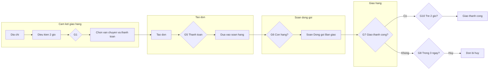
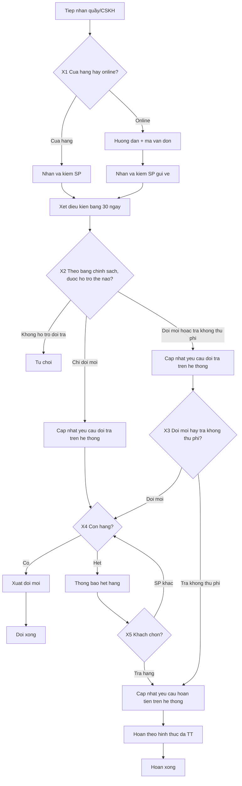

# Hướng dẫn vẽ sơ đồ BPMN — Quy trình B2 và B4

**Mục đích:** hướng dẫn nhóm vẽ hai sơ đồ BPMN 2.0 cho quy trình cốt lõi (*core processes*).  
**Nguồn chuẩn ranh giới:** [research.md](../02-research/research.md) §4.3 — **B2 là một quy trình** từ Đặt hàng đến giao/hủy, gồm cả nhánh **giao 2 giờ** và **giao thường**; không tách “mua hàng online” và “giao 2H” thành hai core trên kiến trúc.  
**Nguyên tắc:** cổng XOR (*XOR gateway*) chỉ đặt khi **luồng phía sau khác nhau**; tiêu chí kiểm tra trong cùng một lần xét điều kiện đổi trả ghi trong **hoạt động (*activity*) + bảng quyết định (*decision table*)**, không xẻ thành nhiều cổng chỉ để đủ điểm.  
**Thiết kế đề xuất:** B2 khoảng **10** cổng (nhiều nhánh vận hành thật, kể cả 2H/thường); B4 khoảng **6** cổng nghiệp vụ (X0–X5): walk-in/liên hệ, cửa hàng/online, bảng Hasaki, đổi|trả, còn hàng, hết hàng → SP khác|trả (suy luận, không bắt buộc hoàn).  
**Phân tích nghiệp vụ chi tiết:** xem file [ba_model_b2_b4.md](./ba_model_b2_b4.md).  
**Công cụ gợi ý:** Camunda Modeler hoặc bpmn.io.  
**Tên file nên đặt:** `b2-xu-ly-don-hang-online.bpmn`, `b4-doi-tra-hoac-hoan-tien.bpmn`.

---

## Một số khái niệm cần nắm trước khi vẽ

| Khái niệm | Giải thích ngắn |
|-----------|-----------------|
| **BPMN** | *Business Process Model and Notation* — chuẩn ký hiệu quốc tế để vẽ quy trình nghiệp vụ (hộp hoạt động, mũi tên, cổng điều kiện, sự kiện bắt đầu/kết thúc). |
| **Bể bơi (*pool*)** | Khung lớn thể hiện một tổ chức hoặc một bên tham gia (ví dụ: Khách hàng, Hasaki). |
| **Làn (*lane*)** | Hàng ngang trong bể bơi, gắn với **vai trò nghiệp vụ** (Hệ thống kênh bán, Kho/cửa hàng, Đơn vị giao, Chăm sóc đơn…) — **không** tách làn “giao diện / máy chủ”. |
| **Cổng XOR (*XOR gateway*)** | Cổng điều kiện “hoặc cái này hoặc cái kia” — chỉ đi **một** nhánh. Nhãn cổng nên là câu hỏi nghiệp vụ. |
| **Tách nhánh / gộp nhánh (*split / join*)** | Sau khi tách bằng cổng XOR, khi các nhánh gặp lại cần cổng gộp tương ứng để luồng không “treo”. |
| **Sự kiện bắt đầu / kết thúc (*start / end event*)** | Mở hoặc đóng một lần chạy quy trình (*process instance*). |
| **Hoạt động (*activity*)** | Việc thực hiện trên sơ đồ (ô chữ nhật) — tên việc nghiệp vụ, không tên API hay màn hình lập trình. |
| **Luồng tuần tự (*sequence flow*)** | Mũi tên nối các phần tử trong cùng một bể bơi. |

**Quy ước khi vẽ**

1. Nhãn cổng điều kiện viết bằng câu hỏi tiếng Việt (ví dụ: *Đủ điều kiện đề xuất giao 2 giờ?*).  
2. Việc kiểm tra điều kiện giao nhanh, tạo đơn, chặn thanh toán khi nhận với đơn lớn đặt ở làn **Hệ thống**.  
3. Việc soạn hàng, giao hàng, gọi khách đặt ở làn **con người**.  
4. Không vẽ cơ sở dữ liệu, giao diện lập trình, hay tầng Frontend/Backend.  
5. Dưới hình ghi chú nguồn trang hỗ trợ Hasaki; bước nào suy luận theo chuẩn ngành thì ghi rõ.  
6. Một sơ đồ B2 phủ cả nhánh 2 giờ và giao thường (G1–G2); đối tác vận chuyển giao thường = bể bơi ngoài hoặc hộp đen nếu cần.

---

# Phần A — Quy trình B2: Xử lý đơn hàng trực tuyến và giao hàng

## A.1. Hồ sơ quy trình (*process profile* — đưa vào báo cáo)

| Trường | Nội dung |
|--------|----------|
| Tên quy trình | Xử lý đơn hàng trực tuyến và giao hàng — gồm giao nhanh 2 giờ và giao thường (*Order-to-Delivery*) |
| Khách hàng của quy trình (*process customer*) | Khách đặt hàng trên website hoặc ứng dụng Hasaki |
| Sự kiện kích hoạt (*trigger*) | Khách bấm **Đặt hàng** (sau khi đã chọn địa chỉ, hình thức vận chuyển, thanh toán trên màn hình) |
| Đối tượng theo dõi (*case*) | Một mã đơn hàng |
| Kết thúc (*outcomes*) | **Giao thành công** hoặc **Đơn bị hủy** (có hoàn tiền nếu khách đã trả trước) |
| Ngoài lần chạy (*out of scope*) | Duyệt ứng dụng / xem sản phẩm / giỏ bỏ dở — không tạo mã đơn, không đo thời gian chu kỳ; đổi trả sau nhận (B4) |
| Đo thời gian chu kỳ (*cycle time*) | Từ tạo đơn (sau Đặt hàng) đến giao thành công / hủy; không gồm thời gian lựa hàng — khớp [research.md](../02-research/research.md) §4.3 |
| Lưu ý kiến trúc | **Một** sơ đồ B2 cho cả nhánh 2 giờ và giao thường — không nộp hai core “checkout” + “chỉ giao 2H” |
## A.2. Các giai đoạn trên sơ đồ (*process stages* — vẽ từ trái sang phải)

Trong quản trị chuỗi cung ứng bán lẻ, chu kỳ xử lý đơn thường được chia thành các giai đoạn. Nhóm dùng cách chia này để sơ đồ dễ đọc. Giai đoạn 1 là **cam kết trên màn hình trước khi đặt** (để đủ cổng); lần chạy quy trình và định lượng bắt đầu từ giai đoạn 2:

| Giai đoạn | Việc chính thể hiện trên sơ đồ |
|-----------|--------------------------------|
| 1. Cam kết giao hàng | Theo địa chỉ hiện lựa chọn vận chuyển; kiểm tra điều kiện giao 2 giờ; tính phí; khách chọn *(chưa chắc có đơn nếu dừng)* |
| 2. Tạo đơn và sẵn sàng lấy hàng | Bấm Đặt hàng → tạo mã đơn; thanh toán (nếu cần); đưa đơn vào soạn hàng |
| 3. Soạn – đóng gói – bàn giao | Kiểm tồn lúc soạn; soạn; đóng gói; bàn giao **shipper 2 giờ** hoặc **đối tác giao thường** |
| 4. Giao đến khách | Giao tận nơi (nhánh 2 giờ hoặc thường); thu tiền nếu thanh toán khi nhận; xác nhận đã giao |
| 5. Xử lý ngoại lệ và đóng đơn | Hẹn giao lại; hủy sau 3 ngày không liên lạc; đổi địa chỉ; phiếu 100.000đ nếu giao 2 giờ trễ |

## A.3. Bể bơi và làn (*pools and lanes*)

```text
Bể bơi: Khách hàng
Bể bơi: Hasaki
  Làn: Hệ thống kênh bán hàng
  Làn: Kho / cửa hàng
  Làn: Giao hàng 2 giờ (nhân viên giao nhanh)   ← nhánh NowFree
  Làn: Đối tác vận chuyển                        ← nhánh giao thường (hoặc hộp đen / pool ngoài)
  Làn: Chăm sóc khách hàng – Vận hành đơn
```

Có thể gộp “Giao hàng 2 giờ” và “Đối tác vận chuyển” thành một làn **Đơn vị giao hàng** nếu hình quá dày — miễn trên cổng G1/G2 vẫn thấy rõ hai nhánh nghiệp vụ.

## A.4. Tên hoạt động (*activity labels*) gợi ý trên hình

**Khách hàng:** cung cấp địa chỉ → chọn hình thức vận chuyển → chọn thanh toán → đặt hàng → thanh toán trước (nếu có) → nhận và kiểm hàng → trả tiền khi nhận (nếu có).

**Hệ thống:** xác định hình thức vận chuyển được phép → kiểm tra điều kiện giao 2 giờ (vùng áp dụng + hàng sẵn tại kho gần) → tính phí vận chuyển → ràng buộc thanh toán (đơn trên 5 triệu chỉ thanh toán trước) → tạo đơn → ghi nhận kết quả thanh toán → cập nhật trạng thái → hoàn tiền khi hủy đơn đã trả trước.

**Kho / cửa hàng:** nhận lệnh soạn (ưu tiên đơn 2 giờ) → soạn hàng → đóng gói theo chuẩn Hasaki → bàn giao đơn vị giao → nhận hàng hoàn (khi hủy hoặc giao không thành).

**Đối tác / đơn vị giao:** nhận kiện → liên hệ và giao → thu tiền khi nhận và đối soát (nếu giao thường) → báo kết quả giao. Nhánh 2 giờ: ưu tiên bán kính ngắn, bám giờ nhận dự kiến.

**Chăm sóc khách hàng:** hẹn giao lại hoặc hướng dẫn nhận tại điểm → thông báo hủy sau 3 ngày không liên lạc → xử lý đổi địa chỉ hoặc hủy khi địa điểm không giao được → xét cấp phiếu 100.000đ khi giao 2 giờ trễ đủ điều kiện.

## A.5. Mười cổng điều kiện XOR (*XOR gateways* — bắt buộc đếm trên hình)

| Mã | Câu hỏi ghi trên cổng | Nhánh |
|----|----------------------|-------|
| G1 | Đủ điều kiện để **đề xuất** giao nhanh 2 giờ? | Có / Không |
| G2 | Khách chọn giao nhanh 2 giờ? | Có / Không |
| G3 | Đơn hàng trên 5.000.000 đồng? | Chỉ thanh toán trước / Cho chọn thêm thanh toán khi nhận |
| G4 | Khách chọn thanh toán trước? | Thanh toán trước / Thanh toán khi nhận |
| G5 | Thanh toán trước thành công? | Thành công / Thử lại / Thất bại → hủy |
| G6 | Hàng vẫn còn tại điểm lấy lúc soạn? *(suy luận ngành)* | Có → đóng gói / Không → xử lý hết hàng |
| G7 | Giao hàng lần này thành công? | Thành công / Không thành |
| G8 | Còn trong 3 ngày và hẹn giao lại được? | Hẹn lại / Hủy đơn |
| G9 | Đổi được địa chỉ giao khác không? | Đổi địa chỉ / Hủy đơn |
| G10 | Đơn giao 2 giờ trễ và đủ điều kiện tặng phiếu 100.000đ? | Cấp phiếu / Kết thúc |

Ghi chú G6: trang hỗ trợ Hasaki nói hàng phải sẵn lúc đặt, nhưng ít mô tả khi lúc soạn mới hết hàng. Trên sơ đồ giữ nhánh này theo thực tế vận hành bán lẻ và ghi chú *suy luận chuẩn ngành*.

## A.6. Luồng điển hình (*happy path* — để đối chiếu khi vẽ)

**Thành công — giao 2 giờ + thanh toán trước:**  
Địa chỉ thuộc vùng → đủ điều kiện đề xuất 2 giờ → khách chọn 2 giờ → thanh toán trước thành công → tạo đơn → soạn → giao thành công → (nếu không trễ) kết thúc giao thành công.

**Thành công — giao thường + thanh toán khi nhận:**  
Không chọn 2 giờ → tạo đơn → soạn → giao → khách trả tiền khi nhận → kết thúc.

**Ngoại lệ:** giao không thành → hẹn lại; quá 3 ngày không liên lạc → hủy và hoàn tiền (nếu đã trả trước).

## A.7. Danh mục kiểm tra (*checklist*) trước khi nộp hình B2

- [ ] Đọc được năm giai đoạn từ trái sang phải  
- [ ] Đủ 10 cổng XOR có nhãn câu hỏi tiếng Việt  
- [ ] Cam kết giao hàng ở làn Hệ thống; soạn hàng ở Kho; giao ở đối tác vận chuyển; hủy 3 ngày và phiếu 100.000đ ở chăm sóc khách hàng  
- [ ] Có chú thích: bắt đầu lần chạy = Đặt hàng; giai đoạn cam kết là bước trên màn hình trước khi đặt  
- [ ] Có **cả hai** nhánh giao 2 giờ và giao thường (sau G1/G2)  
- [ ] Có chú thích nguồn trang hỗ trợ Hasaki  
- [ ] Có chú thích G6 là suy luận ngành  
- [ ] Không dùng làn Frontend/Backend; tên activity là việc nghiệp vụ  

---

# Phần B — Quy trình B4: Đổi trả hoặc hoàn tiền

## B.1. Hồ sơ quy trình (*process profile*)

| Trường | Nội dung |
|--------|----------|
| Tên quy trình | Đổi trả hoặc hoàn tiền (*Return-to-Resolve*) |
| Khách hàng của quy trình (*process customer*) | Khách yêu cầu đổi hoặc trả hàng |
| Sự kiện kích hoạt (*trigger*) | *Yêu cầu đổi trả được tiếp nhận* (walk-in mang hàng hoặc liên hệ CSKH — đồng bộ pool khách) |
| Đối tượng theo dõi (*case*) | Một yêu cầu đổi–trả |
| Kết thúc (*outcomes*) | **Từ chối** / **Đổi hàng xong** / **Hoàn tiền xong** |

## B.2. Các giai đoạn (*process stages* — theo quy trình đổi trả ngành mỹ phẩm)

| Giai đoạn | Việc trên sơ đồ |
|-----------|-----------------|
| 1. Tiếp nhận | Khách báo lý do + liên hệ; hướng dẫn cửa hàng (ưu tiên TP.HCM) hoặc gửi bưu điện; nhắc mang quà nếu đổi SP chính |
| 2. Nhận và kiểm sản phẩm | Tại CH: nhận SP (+ quà nếu có), xem tem / tình trạng; bưu điện: nhận kiện rồi đối chiếu |
| 3. Xét điều kiện đổi trả | **Một** hoạt động: đối chiếu bảng chính sách 30 ngày (xem `ba_model` §II.5) — gồm cả quà kèm khi đổi SP chính |
| 4. Xử lý kết quả | Đổi hàng mới **hoặc** hoàn theo cách đã thanh toán *(một activity hoàn — không xẻ 4 cổng)* |
| 5. Xử lý hàng trả lại | Đưa lại bán được hoặc loại khỏi bán *(suy luận ngành mỹ phẩm)* |

Bản nộp / làm việc chi tiết: [return-to-resolve/](./return-to-resolve/).

## B.3. Bể bơi và làn (*pools and lanes*)

```text
Bể bơi: Khách hàng (white-box — walk-in / liên hệ → mang CH hoặc gửi online → nhận kết quả)
Bể bơi: Hasaki
  Làn: Nhân viên cửa hàng / Chăm sóc khách hàng
  Làn: Kho
  Làn: Kế toán / Hoàn tiền
```

Không vẽ làn Quản lý khi chưa có bằng chứng công bố về mức thẩm quyền. Cổng X0–X5 + message flow đồng bộ hai pool (xem `return-to-resolve/`).

## B.4. Tên hoạt động (*activity labels*) gợi ý

**Khách:** thông báo lý do + liên hệ → mang tới cửa hàng hoặc gửi bưu điện (kèm quà nếu đổi SP chính) → nhận hàng đổi hoặc nhận hoàn.

**Nhân viên / CSKH:** ghi nhận thông tin yêu cầu (quầy hoặc CSKH) → nhận & kiểm tại cửa hàng **hoặc** hướng dẫn gửi online → **xét điều kiện bảng 30 ngày** → giải thích nếu từ chối → thông báo hết hàng → hỏi SP khác hoặc trả.

**Kho:** nhận & kiểm hàng gửi về → kiểm còn hàng khi đổi → giao/gửi đổi → xử lý hàng trả.

**Kế toán:** hoàn theo phương thức trên website (tiền mặt / CK 3–5 ngày / VNpay 3–8 hoặc 15–90 ngày hoặc chuyển sang đơn sau; trả tại nhà: sau khi nhận hàng).

## B.5. Cổng XOR — chỉ khi luồng phía sau khác nhau (*XOR gateways*)

**Không** tách mỗi tiêu chí trong bảng 30 ngày thành một cổng. **Không** dùng cổng “hồ sơ đủ xét điều kiện đổi trả” (không sát thực tế quầy mỹ phẩm — xem [return-to-resolve.md](./return-to-resolve/return-to-resolve.md) §0).

| Mã | Câu hỏi ghi trên cổng | Nhánh | Vì sao là cổng |
|----|----------------------|-------|----------------|
| X1 | Hàng về cửa hàng hay gửi online? | Cửa hàng (gồm walk-in hoặc đã liên hệ rồi mang tới) / Online | Handoff Level 2 |
| X2 | Theo bảng chính sách 30 ngày, được hỗ trợ thế nào? | Không hỗ trợ đổi trả / Chỉ đổi mới / Đổi mới hoặc trả không thu phí | Bảng Hasaki |
| X3 | Khách chọn đổi mới hay trả không thu phí? | Đổi mới / Trả không thu phí | Chỉ khi X2 cho phép cả hai |
| X4 | Còn hàng sản phẩm muốn đổi? | Còn → xuất đổi / Hết → thông báo | Suy luận vận hành; trang Hasaki không mô tả nhánh hết hàng |
| X5 | Khách chọn phương án nào? | SP khác còn hàng / Trả hàng–hoàn | Suy luận; **không** ghi Hasaki bắt buộc hoàn khi hết hàng |

Sau khi đủ điều kiện: **cập nhật yêu cầu đổi trả trên hệ thống đơn hàng**; trước khi hoàn: **cập nhật yêu cầu hoàn tiền trên hệ thống đơn hàng**. Trả từ tỉnh / tại nhà → nhận hàng trước rồi mới hoàn. Chi tiết: [return-to-resolve/](./return-to-resolve/).

## B.6. Luồng điển hình (*happy path*)

**Đổi tại cửa hàng:** tiếp nhận → mang tới CH → nhận & kiểm SP → xét điều kiện đổi trả đạt → đổi → còn tồn → xuất đổi → xử lý hàng trả → đổi thành công.

**Trả từ tỉnh:** tiếp nhận → gửi bưu điện → nhận kiện → xét điều kiện đổi trả đạt → trả → hoàn theo cách đã thanh toán → xử lý hàng trả → hoàn tiền xong.

**Từ chối:** xét điều kiện đổi trả không đạt → giải thích → kết thúc từ chối.

## B.7. Danh mục kiểm tra (*checklist*) trước khi nộp hình B4

- [ ] Có **một** hoạt động xét điều kiện đổi trả + bảng quyết định; **không** chuỗi cổng checklist / không cổng “hồ sơ đủ”  
- [ ] Mỗi cổng XOR đổi được nhánh xử lý phía sau  
- [ ] Hoàn tiền **sau** khi đã nhận hàng (trả tại nhà / gửi bưu điện)  
- [ ] Chú thích chính sách 30 ngày (từ 01/06/2024) + link trang đổi trả  
- [ ] Xử lý hàng trả có ghi chú suy luận ngành nếu cần  
- [ ] ~6 cổng nghiệp vụ (X0–X5) là chấp nhận được; không ép thêm cổng chỉ để >7 

---

# Phần C — Kiểm tra nhanh trước khi nộp (*final checklist*)

| Quy trình | Số cổng thiết kế | Ghi chú rubik |
|-----------|------------------|---------------|
| B2 | ~10 (G1–G10) | Nhiều nhánh vận hành thật; phù hợp ngưỡng >7 |
| B4 | ~6 (X0–X5) | Walk-in/liên hệ + cửa hàng/online + bảng Hasaki + hết hàng (suy luận); >7 cổng lấy ở B2 |

| Nội dung nghiệp vụ dễ quên | Thể hiện trên hình |
|----------------------------|--------------------|
| Cam kết giao hàng khác với soạn hàng | Giai đoạn 1 khác giai đoạn 3 (B2) |
| Hủy sau 3 ngày và hoàn trong 30 ngày | G8 → thông báo hủy → hoàn tiền |
| Phiếu 100.000đ có trường hợp miễn trừ | G10 |
| Tem / chưa sử dụng / 30 ngày / quà kèm | Trong **nhận hàng + hoạt động xét điều kiện đổi trả** + bảng quyết định, không phải chuỗi cổng “hồ sơ” |
| Hoàn theo phương thức trên website Hasaki | Một activity hoàn (ghi chú thời hạn), không xẻ cổng theo kênh; không mã phiếu quà |

---

# Phần D — Sơ đồ logic tham chiếu (*reference flow* — không thay file BPMN nộp)

## B2 (rút gọn)



## B4 (rút gọn)


